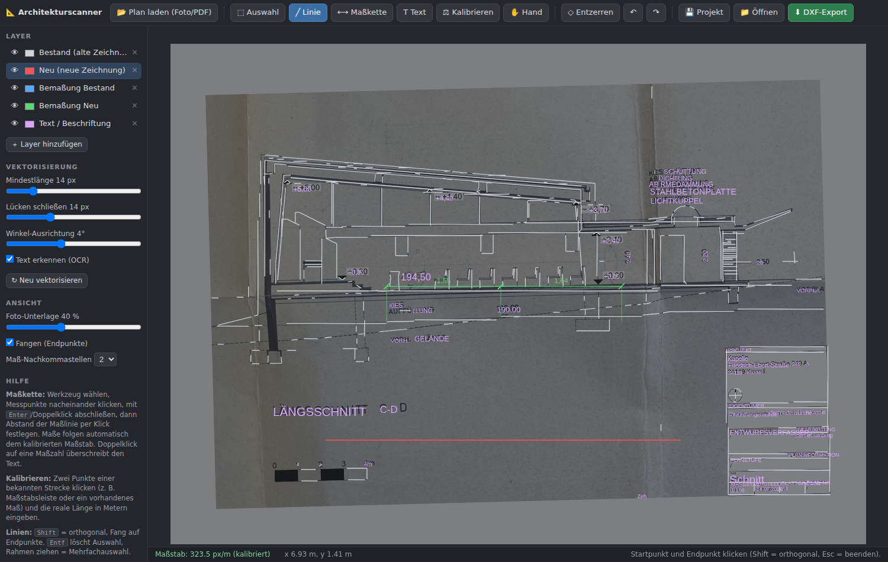

# 📐 Architekturscanner

> Enthält zusätzlich den **🔥 Heizungsrechner** unter `http://localhost:8000/heizung`
> – siehe [Abschnitt unten](#-heizungsrechner).

Digitalisiert abfotografierte oder gescannte Altpläne (Foto/PDF) zu **exakten,
geraden, maßstäblichen CAD-Zeichnungen** – mit editierbaren Maßketten,
Layern und DXF-Export (AutoCAD/DWG-kompatibel).



## Was das Programm kann

- **Automatische Vektorisierung**: Beleuchtungsausgleich, Entzerrung der
  Verdrehung (Deskew), Skelettierung und Linienerkennung machen aus krummen,
  fotografierten Linien gerade, exakt horizontale/vertikale Segmente.
  Schräge Linien (z. B. Dachneigungen) bleiben erhalten.
- **Lange, logische Linien statt Fragmente**: kollineare Stücke werden
  spurweise zu durchgehenden Linien verschmolzen, Lücken unter entfernter
  Beschriftung überbrückt, Ecken exakt geschlossen. Gefüllte Flächen
  (Wände, Decken) werden als saubere Konturzüge übernommen.
- **Text bleibt Text**: erkannte Beschriftungen werden vor der
  Linienerkennung maskiert und als editierbare Textobjekte übernommen –
  Buchstaben werden nicht zu Linien vektorisiert. Papierkanten und
  Faltenschatten werden ausgefiltert.
- **Perspektiv-Entzerrung**: 4 Ecken des Plans klicken → das Foto wird
  rechtwinklig entzerrt (Knopf „◇ Entzerren“).
- **Maßstab kalibrieren**: Zwei Punkte einer bekannten Strecke klicken
  (z. B. Maßstabsleiste oder ein vorhandenes Maß) und die reale Länge in
  Metern eingeben. Danach sind alle Maße und der Export **maßstäblich**.
- **Maßketten**: Beliebig viele Messpunkte klicken → Maßkette mit
  automatisch berechneten, maßstäblichen Werten. Punkte sind nachträglich
  verschiebbar (Werte aktualisieren sich), die Maßlinie ist frei
  positionierbar, einzelne Maßtexte per Doppelklick überschreibbar.
  Damit sind **nachträgliche Messungen** direkt im Plan möglich.
- **Neue Linien zeichnen**: Klick-Klick mit Endpunkt-Fang und
  Orthogonal-Modus (Shift).
- **Getrennte Layer** (frei erweiterbar, Farbe/Sichtbarkeit je Layer):
  - Bestand (alte Zeichnung) – Ergebnis der Vektorisierung
  - Neu (neue Zeichnung)
  - Bemaßung Bestand / Bemaßung Neu
  - Text / Beschriftung
- **Texterkennung (OCR)**: Beschriftungen des Zeichners (Schriftfeld,
  Anmerkungen) werden optional per Tesseract erkannt und als editierbare
  Textobjekte übernommen.
- **DXF-Export**: Linien, echte DIMENSION-Entities und Texte auf ihren
  Layern, Koordinaten in Metern. Die Datei öffnet in AutoCAD, BricsCAD,
  LibreCAD u. a. – von dort „Speichern als DWG“ (DWG ist ein proprietäres
  Format; DXF ist das offizielle Austauschformat und verlustfrei
  konvertierbar, z. B. auch mit dem kostenlosen ODA File Converter).
- **Projekt speichern/laden** als JSON (inkl. Foto, Layern, Maßketten).
- Undo/Redo (Strg+Z / Strg+Y), Mehrfachauswahl per Rahmen, Löschen mit Entf.

## Installation & Start

```bash
pip install -r requirements.txt
# optional für OCR:  apt-get install tesseract-ocr tesseract-ocr-deu
python server.py
```

Dann <http://localhost:8000> öffnen.

## Empfohlener Arbeitsablauf

1. **Plan laden** (Foto oder PDF).
2. Bei schrägem Foto: **◇ Entzerren** und die 4 Plan-Ecken klicken.
3. **⚖ Kalibrieren**: bekannte Strecke klicken, reale Länge in m eingeben.
4. Erkannte Linien prüfen: Störlinien mit Rahmenauswahl + Entf löschen,
   fehlende Linien mit dem Linienwerkzeug nachziehen.
5. **⟷ Maßketten** anlegen (alte Maße nachbilden oder neue Messungen).
6. **⬇ DXF-Export** → in CAD öffnen, bei Bedarf als DWG speichern.

## Tastenkürzel

| Taste | Funktion |
|---|---|
| `V` / `L` / `M` / `T` / `K` / `H` | Auswahl / Linie / Maßkette / Text / Kalibrieren / Hand |
| `Shift` | orthogonal zeichnen |
| `Enter` / Doppelklick | Maßkette abschließen |
| `Entf` | Auswahl löschen |
| `Strg+Z` / `Strg+Y` | Rückgängig / Wiederholen |
| Mausrad / mittlere Taste | Zoom / Ansicht verschieben |

## Technik

- **Backend**: Python, FastAPI, OpenCV (adaptive Binarisierung,
  Zhang-Suen-Skelettierung, Hough-Segmente, Winkel-Snapping, kollineares
  Zusammenführen, Eckpunkt-Clustering), ezdxf, PyMuPDF, Tesseract (optional).
- **Frontend**: Vanilla-JS-Canvas-Editor ohne Build-Schritt.
- Vektorisierungs-Parameter (Mindestlänge, Lückenschluss, Winkeltoleranz)
  sind in der Seitenleiste einstellbar; „Neu vektorisieren“ wendet sie an,
  ohne eigene Zeichnungen/Maßketten zu verlieren.

---

# 🔥 Heizungsrechner

Berechnet, **welche Heizung sich für ein konkretes Haus lohnt** – als
Web-Oberfläche unter <http://localhost:8000/heizung> (gleicher Server,
`python server.py`).

## Eingaben

- **Gebäude**: Baujahr, Wohnfläche, Etagen, Raumhöhe, Personen – daraus werden
  beheiztes Volumen, Gebäudekubatur und Wärmehüllfläche berechnet.
- **Dach**: Dachform (Satteldach, Flachdach, Pult-, Walm-, Mansard-, Zeltdach)
  und Dämmzustand.
- **Mauerwerk**: Wandaufbau (massiv, zweischalig, Beton, Fachwerk, Holz) und
  Dämmzustand, Fensterqualität, Keller/Bodenplatte samt Dämmung.
- **Bestandsheizung**: Heizart (Öl, Gas, Wärmepumpe, Pellets, Fernwärme,
  Nachtspeicher) und Baujahr der Anlage.
- **Räume**: je Raum Fläche und Wärmeübergabe (Fußbodenheizung, Heizkörper,
  Wand-/Deckenheizung, Konvektor) – daraus ergibt sich die mittlere
  Vorlauftemperatur und damit insbesondere die Wärmepumpen-Effizienz (JAZ).
- **Förderung**: BEG-Boni (Klimageschwindigkeit, Einkommen) zuschaltbar.
- **Preise & Baukosten (anpassbar)**: Energiepreise je Träger,
  Gesamtinvestition je System und Baukosten-Sätze (€/m² für Fußbodenheizung,
  Dach-/Fassaden-/Kellerdeckendämmung, Fenster) – leere Felder nutzen
  Richtwerte, die automatisch mit der Heizlast skalieren.

## Ergebnisse

- **Gebäudeanalyse**: Heizlast (kW), Jahres-Heizwärmebedarf (kWh/a),
  spezifischer Bedarf, Aufteilung der Wärmeverluste (Wände, Dach, Fenster,
  Boden, Lüftung) – vereinfachtes Hüllflächen-/Gradtagzahlverfahren.
- **Systemvergleich**: Luft-/Sole-Wärmepumpe, Gas- und Öl-Brennwert, Pellets,
  Fernwärme, Stromdirekt – Investition, Förderung, Energie- und Vollkosten,
  CO₂, kumulierte Kosten über 20 Jahre und **Amortisation gegenüber dem
  Weiterbetrieb der Bestandsanlage** (interaktive Charts mit Tooltip).
- **Heizart-Vergleich**: Ist-Zustand vs. „alles Heizkörper“ vs. „alles
  Fußbodenheizung“ – Effekt der Vorlauftemperatur auf JAZ und Kosten.
- **Maßnahmen**: Dach-/Fassaden-/Kellerdeckendämmung, Fenstertausch,
  hydraulischer Abgleich, Fußbodenheizungs-Nachrüstung – jeweils Kosten,
  Ersparnis pro Jahr und Amortisationszeit.
- **Bau-/Investitionskosten aufgeschlüsselt**: Gerät, Installation, Speicher,
  Umfeldkosten (Demontage, Erdbohrung, Hausanschluss, Öltank-Entsorgung …) –
  sichtbar im Chart-Tooltip und im PDF.
- **Rentabilität & Optimum**: Alle Varianten (Wärmeerzeuger × Wärmeübergabe ×
  Dämmpaket) werden gegen „nichts tun“ gerechnet. **Optimum-Definition:**
  höchster Nettovorteil über 20 Jahre (Bestandskosten − Variantenkosten
  inkl. aller Bau-/Investitionskosten), sofern die Variante sich im
  Betrachtungszeitraum amortisiert. Das Optimum ist mit ★ markiert, die
  Amortisationspunkte sind in den Kostenverläufen als Punkte eingezeichnet;
  je Variante werden Kapitaleinsatz, Ersparnis/Jahr und Rendite (%/Jahr)
  ausgewiesen.
- **Empfehlung**: bester Wärmeerzeuger + beste Wärmeübergabe.
- **📄 PDF-Bericht**: mehrseitiger Bericht mit allen Kennzahlen, Charts,
  Tabellen, Kosten-Aufschlüsselung, Empfehlung und eigener Rentabilitätsseite
  samt markiertem Optimum (`POST /api/heizung/report`).

Alle Preise/Förderwerte sind Richtwerte (Stand 2026); die Berechnung ersetzt
keine Heizlastberechnung nach DIN EN 12831 oder GEG-Energieberatung.
