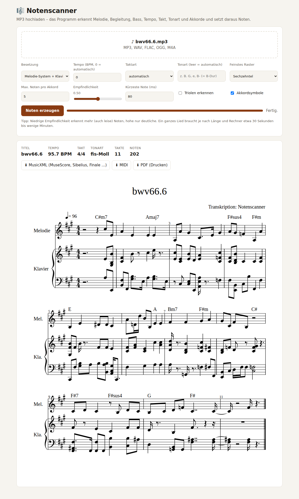

# 🎼 Notenscanner

Macht aus **MP3-Dateien** (auch WAV, FLAC, OGG, M4A) einen **kompletten Notensatz
des ganzen Lieds**: Melodie, Begleitung und Bass mit Tempo, Taktart, Tonart,
Vorzeichen und Akkordsymbolen. Ausgabe als **PDF**, **MusicXML** (zum
Weiterbearbeiten in MuseScore, Sibelius, Finale, Dorico …) und **MIDI**.



## So funktioniert es

| Schritt | Verfahren |
|---|---|
| 1. Instrumente trennen *(optional, Besetzung „Band“)* | [Demucs](https://github.com/facebookresearch/demucs) zerlegt das Lied in Gesang, Bass, Schlagzeug, Rest |
| 2. Noten erkennen | [Basic-Pitch](https://github.com/spotify/basic-pitch) (Spotify) – neuronales Netz für mehrstimmige Musik, läuft auf der CPU (ONNX) |
| 3. Geistertöne entfernen | Unteroktaven, die nur aus Obertönen „erraten“ wurden, werden verworfen |
| 4. Tempo und Schläge | Beat-Tracking (librosa); folgt auch Tempo-Schwankungen |
| 5. Taktart und „die Eins“ | Akzentmuster aus Basstönen, Akkordwechseln und lauten Einsätzen → 3/4 oder 4/4, inkl. Auftakt |
| 6. Quantisieren | Noten auf Sechzehntel- bzw. Achtelraster (optional Triolen) |
| 7. Tonart | Krumhansl-Schmuckler-Verfahren → Vorzeichen und richtige Schreibweise (ais/b) |
| 8. Akkordsymbole | je halbem Takt, z. B. `Am`, `G7`, `Fmaj7` |
| 9. Notensatz | Melodie-System, Klavier (rechte/linke Hand), Bass → MusicXML/MIDI ([music21](https://web.mit.edu/music21/)), PDF über MuseScore oder LilyPond |

### Besetzungen

- **Melodie + Klavier** (Standard): oberste Stimme als eigenes Melodiesystem, darunter die Begleitung als Klaviersatz
- **Klaviersatz**: alles auf zwei Systemen wie ein Klavierarrangement
- **Leadsheet**: nur Melodie mit Akkordsymbolen
- **Band**: Gesang, Klavier/Begleitung und Bass aus getrennten Spuren (benötigt Demucs, am genauesten bei Pop/Rock mit Gesang)

## Installation

Voraussetzungen: **Python 3.10 – 3.12** und **ffmpeg** (zum Lesen von MP3).

```bash
# Linux / macOS
./install.sh

# Windows
install.bat
```

Optional:

- **PDF-Ausgabe**: [MuseScore](https://musescore.org) *oder* [LilyPond](https://lilypond.org) installieren.
  Ohne beides gibt es MusicXML + MIDI; das MusicXML in MuseScore öffnen und dort drucken.
- **Instrumententrennung** (Besetzung „Band“): `.venv/bin/pip install demucs`
  (lädt beim ersten Lauf ca. 80 MB Modell herunter; eine Grafikkarte beschleunigt stark).

## Benutzung

### Weboberfläche

```bash
./start.sh        # Windows: start.bat
```

Öffnet <http://127.0.0.1:8001>. MP3 hineinziehen → **Noten erzeugen** → Notenbild
erscheint im Browser, darunter Downloads (PDF, MusicXML, MIDI) und ein Player
zum Anhören des Ergebnisses.

### Kommandozeile

```bash
.venv/bin/python -m notenscanner lied.mp3                      # → ./noten/
.venv/bin/python -m notenscanner *.mp3 -o meine_noten          # viele Lieder auf einmal
.venv/bin/python -m notenscanner lied.mp3 -a klavier --tempo 92 --takt 3/4 --tonart G
.venv/bin/python -m notenscanner lied.mp3 -a band               # mit Demucs
```

| Option | Bedeutung |
|---|---|
| `-a, --satz` | `melodie+klavier` (Standard), `klavier`, `leadsheet`, `band` |
| `--tempo BPM` | Tempo vorgeben statt automatisch |
| `--takt 3/4` | Taktart vorgeben (2/4, 3/4, 4/4, 6/4) |
| `--tonart G` | Tonart vorgeben (`G` = G-Dur, `e` = e-Moll, `B-` = B-Dur, `f#` = fis-Moll) |
| `--raster 8` | gröberes Raster (Achtel) → einfacher zu lesen |
| `--triolen` | Triolen erkennen |
| `--empfindlichkeit 0.6` | höher = nur deutliche Noten, niedriger = mehr Noten |
| `--min-dauer 120` | kürzere Noten (ms) ignorieren |
| `--max-stimmen 3` | höchstens 3 Noten pro Akkord (leichter spielbar) |
| `--keine-akkorde` | keine Akkordsymbole |
| `--kein-pdf` | nur MusicXML + MIDI |

## Wie genau ist das?

Gemessen an Klavieraufnahmen mit bekannten Originalnoten (Bach-Choral BWV 66.6,
Joplin „Maple Leaf Rag“, komplett):

| | Bach-Choral | Maple Leaf Rag (2:12 min) |
|---|---|---|
| Richtig erkannte Noten (Recall) | 91 % | 88 % |
| Davon korrekt (Precision) | 74 % | 75 % |
| Tempo | 95,7 BPM (Original 96) | 117,5 BPM (Original 100 → 120) |
| Tonart | fis-Moll ✓ | As-Dur ✓ |
| Taktart | 4/4 ✓ | 4/4 (Original 2/4 – gleichwertig, doppelt so lange Takte) |
| Rechenzeit inkl. PDF (CPU) | ~8 s | ~20 s |

**Ehrlich gesagt:** Automatische Transkription ist nie perfekt. Am besten
klappt es bei Klavier, Gitarre und klar abgemischten Liedern. Bei dichten
Band-Arrangements mit Schlagzeug, Hall und Verzerrung ist die Besetzung
„Band“ (Demucs) deutlich besser, und es werden trotzdem Fehler bleiben. Das
Ergebnis ist ein sehr guter Ausgangspunkt – Feinschliff (Rhythmus-Details,
einzelne falsche Töne) geht am schnellsten, indem man das MusicXML in
MuseScore öffnet und dort korrigiert.

Tipps bei unsauberem Ergebnis:

- Tempo und Taktart selbst angeben (`--tempo`, `--takt`) – dann sitzt das Raster.
- `--raster 8` und `--max-stimmen 3` für ein leichter lesbares Arrangement.
- Bei zu vielen falschen Tönen `--empfindlichkeit 0.6` oder `0.7`.

## Hinweis zum Urheberrecht

Noten von urheberrechtlich geschützten Liedern darf man für den privaten
Gebrauch erstellen; veröffentlichen oder weitergeben ist nur mit Erlaubnis
der Rechteinhaber erlaubt.

## Tests

```bash
.venv/bin/pip install pytest
.venv/bin/python -m pytest tests
```
