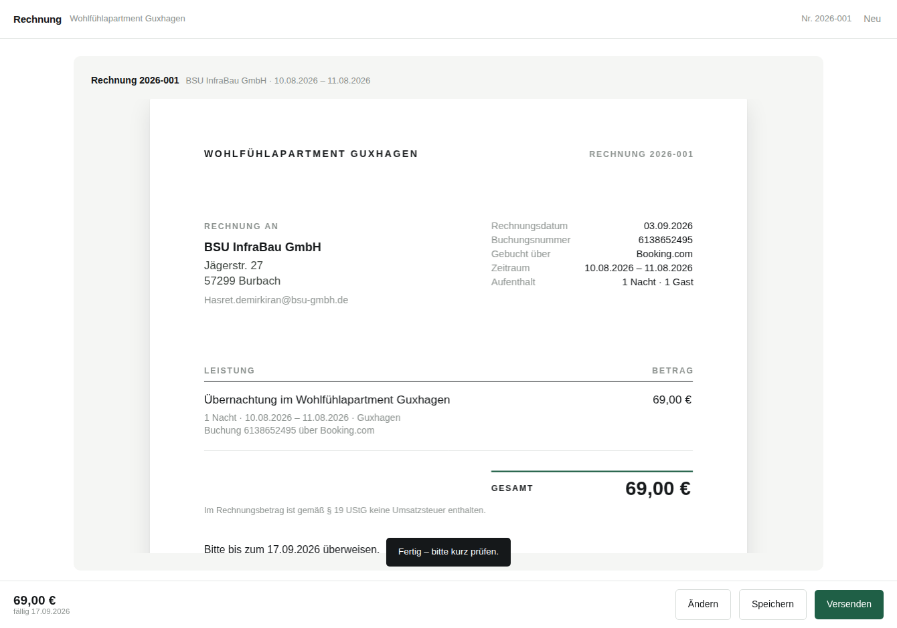

# Rechnung – Gästerechnungen in Sekunden

Aus einem Booking.com-/Airbnb-Screenshot wird eine fertige PDF-Rechnung. Ohne
Konto, ohne Server, ohne Fremdbibliotheken – das PDF wird direkt im Browser bzw.
in Node erzeugt.

Gestaltung: weißes Blatt, Haarlinien statt Kästen, Eingabefelder nur mit
Unterlinie, Ziffern in gleicher Breite. Farbe kommt zweimal vor – auf dem
PDF-Knopf und als schmaler Strich über der Summe. Die Entwürfe dazu liegen in
[`../design/`](../design/README.md).



## Fünf Schritte

1. **Scan einfügen** – Screenshot oder Foto der Buchung hineinziehen, tippen
   oder einfach einfügen (⌘V). Kein Bild zur Hand? *Text statt Bild einfügen*
   nimmt den Text aus der Booking-Nachricht oder ein JSON von Claude;
   *Leere Rechnung schreiben* beginnt von Hand.
2. **Rechnung erzeugen** – ein Knopf. Als Artifact auf claude.ai liest Claude
   die Bilder aus (auf dem Konto des Betrachters, nach dessen Zustimmung) und
   füllt Empfänger, Zeitraum, Buchungsnummer und Preis; sonst greift die
   Texterkennung.
3. **Ändern** – öffnet den Bogen neben der Rechnung: Empfänger, Buchung,
   Positionen. Vermieterdaten, Steuer, Gästeliste und frühere Rechnungen
   liegen darunter unter *Mehr*.
4. **Speichern** – die Rechnung als PDF.
5. **Versenden** – gibt die PDF ans Teilen-Menü des Geräts (Mail, Nachrichten);
   wo das nicht geht, wird sie gespeichert und das Mailprogramm mit fertigem
   Text und der Adresse des Gasts geöffnet.

Alle Zeilen bleiben frei bearbeitbar: Bezeichnung, Detailzeilen, Menge,
Einheit, Einzelpreis. Die Vorschau zeichnet dieselben Befehle wie das PDF und
sieht deshalb aus wie die fertige Datei – auch auf dem Handy.

## Auf der Kommandozeile

```bash
node rechnung/cli.mjs rechnung/beispiel.json          # -> Rechnung_2026-018_BSU-InfraBau-GmbH.pdf
node rechnung/cli.mjs daten.json ausgabe.pdf
cat daten.json | node rechnung/cli.mjs -
```

## Als App aufs Handy

Ordner über einen kleinen Webserver ausliefern und die Seite im Browser als
„Zum Home-Bildschirm hinzufügen“ speichern – danach läuft sie offline
(Service Worker + Manifest):

```bash
python3 -m http.server 8080 --directory rechnung
# Handy im selben WLAN: http://<Rechner-IP>:8080/
```

Ohne Server geht es auch: `index.html` ist eine einzige Datei und funktioniert
per Doppelklick, vom USB-Stick oder aus der Dateien-App.

## Daten

Alles bleibt auf dem Gerät. Vermieterprofil, Kundenliste, letzter Entwurf und
die Historie der erstellten Rechnungen liegen im `localStorage` des Browsers;
Screenshots werden nur im Arbeitsspeicher gehalten.

Datenformat (alle Felder optional außer Betrag und Empfänger):

```json
{
  "vermieter": { "objekt": "Wohlfühlapartment Guxhagen", "iban": "…", "kleinunternehmer": true, "ustSatz": 7 },
  "gast":      { "firma": "BSU InfraBau GmbH", "strasse": "Jägerstr. 27", "plz": "57299", "ort": "Burbach" },
  "rechnung":  { "nummer": "2026-018", "datum": "2026-08-27", "portal": "Booking.com",
                 "buchungsnummer": "6138652495", "anreise": "2026-08-10", "abreise": "2026-08-11",
                 "naechte": 1, "gaeste": 1, "zahlungsziel": 14, "bezahlt": false },
  "positionen": [ { "titel": "Übernachtung", "details": ["…"], "menge": 1, "einheit": "Nacht", "einzelpreis": 69 } ],
  "intern":    { "gesamtpreis": 69, "kommission": 8.28 }
}
```

`intern` erscheint nie auf der Rechnung – die Kommission dient nur der eigenen
Übersicht (Auszahlung = Gesamt − Kommission).

Steuer: Standard ist Kleinunternehmer nach § 19 UStG (kein Ausweis). Wird der
Haken entfernt, lässt sich der Satz (z. B. 7 % Beherbergung) setzen und
festlegen, ob die Preise brutto oder netto gemeint sind.

## Aufbau

| Datei | Zweck |
| --- | --- |
| `src/pdf.mjs` | Minimaler PDF-Schreiber (Helvetica, WinAnsi, Vektor) |
| `src/invoice.mjs` | Datenmodell, Summen, Layout der Rechnung |
| `src/positionen.mjs` | Baut die Übernachtungsposition aus den Buchungsdaten |
| `src/parse.mjs` | Erkennt Buchungsdaten in kopiertem Text |
| `src/ui.mjs` | Bedienoberfläche |
| `src/index.template.html` | Markup und Gestaltung der App |
| `build.mjs` | Bündelt alles zu `index.html` und zur Claude-Vorschau `vorschau.html` |
| `cli.mjs` | Rechnung aus JSON auf der Kommandozeile |

`vorschau.html` ist dieselbe App ohne eigenen Seitenrahmen – zum Veröffentlichen
als Claude-Artifact. Dort kommen zwei Fähigkeiten der Umgebung dazu: `sample`
liest die Screenshots (auf das Claude-Konto des Betrachters, nach dessen
Zustimmung, höchstens so viele Bilder pro Anfrage wie `limits()` erlaubt) und
`downloads` speichert die PDF-Datei, weil die Seite den Download nicht selbst
starten darf. Fehlt eine der beiden, blendet die App den jeweiligen Weg aus –
der Rest funktioniert unverändert.

Nach Änderungen in `src/` neu bündeln:

```bash
node rechnung/build.mjs
```
